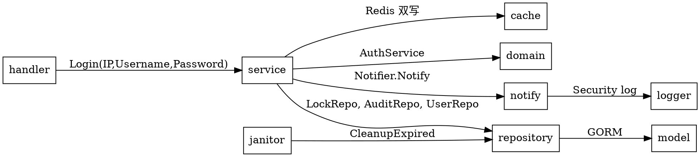

# 登录安全加固设计：路由级限流 + 失败锁定 + 多登录方式预留

| 项目 | 值 |
|---|---|
| 日期 | 2026-06-25 |
| 状态 | 待评审 |
| 模块 | admin / internal/pkg/{middleware,notify,janitor} |
| 关联规则 | [project_rules.md 第 11 / 18 条](file:///d:/WWW/golangProject/roc_way/.trae/rules/project_rules.md) |

## 1. 背景与目标

当前 admin 应用的登录安全能力薄弱：

- 登录接口 `/api/auth/login` 和健康检查 `/healthz` **没有路由级限流**，仅靠全局 `RPS=100` 限流（机器承载力兜底），无法防御「某个接口被恶意刷」的场景；
- 登录失败**没有锁定机制**，攻击者可以无限次试错（暴力破解）；
- 登录账号字段语义错位——`dto.LoginReq.UserName` 字段实际当 email 用（service 层 `FindByEmail`），命名/存储/查询三处不一致；
- 没有预留「手机号登录」扩展点。

**目标**：在不破坏现有 DDD 分层、不引入重量级依赖的前提下，补齐以上 4 项能力；所有改动兼容项目规则 18（统一走 `internal/pkg/response`）。

## 2. 非目标

- 不实现真正的「手机号 + 短信验证码」登录（仅路由 + dto 占位）；
- 不实现安全管理员的「实际推送通道」（邮件 / 钉钉 / IM），仅抽象 `Notifier` 接口 + noop 实现；
- 不重写现有全局限流中间件（保留 RPS/Burst 语义）；
- 不引入分布式锁 / 消息队列等新基础设施。

## 3. 架构总览

```
┌──────────────────────────────────────────────────────────────────────┐
│                          请求路径                                     │
└──────────────────────────────────────────────────────────────────────┘
                                  │
                                  ▼
            ┌──────────────────────────────────────┐
            │  中间件链（注册顺序固定）              │
            ├──────────────────────────────────────┤
            │  1. RequestID        (强制最先)        │
            │  2. Recovery                          │
            │  3. AccessLog                         │
            │  4. CORS                              │
            │  5. Timeout                           │
            │  6. GlobalRateLimit    (RPS 令牌桶)   │ ← 机器承载力兜底
            │  7. RouteRateLimit     (N/Window)    │ ← 路由级，按需挂
            │  8. JWT / CSRF                        │
            │  9. Handler                           │
            └──────────────────────────────────────┘
                                  │
                                  ▼  触发锁定 / 计数
       ┌──────────────────┐   ┌─────────────────┐
       │  internal/pkg/   │   │  internal/pkg/  │
       │     cache        │   │     notify      │
       │  (Redis 主存)    │   │  (NoopNotifier) │
       └────────┬─────────┘   └────────┬────────┘
                │  故障降级            │
                ▼                     ▼
       ┌──────────────────────────────────────┐
       │  internal/app/admin/repository/      │
       │   LoginAuditRepository (MySQL 兜底)   │
       └──────────────────────────────────────┘
                ▲
                │  每天后台清理 + 写入时在线清理
                │
       ┌──────────────────────────────────────┐
       │  internal/pkg/janitor                 │
       │   LoginAuditCleaner                   │
       └──────────────────────────────────────┘
```

## 4. 详细设计

### 4.1 路由级限流（双层防护）

**现状**：`middleware.NewRateLimiter` 用 `RPS + Burst` 令牌桶语义，全局挂在 `e.Use(...)`。

**改造**：`RateLimitOptions` 新增 `Window + Limit` 字段（**N 次/Window** 固定窗口语义），与现有 RPS/Burst 共存：

```go
type RateLimitOptions struct {
    Enabled   bool
    Driver    string         // "memory" | "redis"
    KeyPrefix string
    Cache     *cache.Client

    // 新增：固定窗口模式（用于路由级 20次/分钟）
    Window time.Duration    // 例 time.Minute
    Limit  int              // 例 20

    // 兼容：令牌桶模式（保留给全局限流）
    RPS   float64
    Burst int
}
```

**算法选择**：路由级用 **Redis INCR + EXPIRE 固定窗口**（一次 Redis pipeline 往返，原子）。

```go
// 伪代码
n, _ := rdb.Incr(ctx, key).Result()
if n == 1 { rdb.Expire(ctx, key, window) }
return n <= limit
```

**Key 设计**：

| 用途 | Redis Key 模式 | TTL |
|---|---|---|
| 全局限流 | `rl:global:{client_ip}` | 1 秒（令牌桶） |
| 路由级限流 | `rl:route:{KeyPrefix}:{client_ip}` | Window（例 60s） |

**配置层**（`config.Server` 新增 `RouteLimits []RouteLimitConfig`）：

```yaml
server:
  rate_limit:
    enabled: true
    driver: redis
    rps: 100        # 全局限流，保留
    burst: 200
  route_limits:
    - path: /healthz
      methods: [GET]
      key_prefix: healthz
      window: 1m
      limit: 20
    - path: /api/auth/login
      methods: [POST]
      key_prefix: login
      window: 1m
      limit: 20
```

**`app.go` 注册顺序**（关键）：

```go
// 全局限流：所有请求都计数
e.Use(globalRateLimitMw)

// 路由级限流：仅在路由被命中时计数
e.GET("/healthz", routeLimitMw, handler.health)
apiGroup.POST("/api/auth/login", routeLimitMw, handler.login)
```

**全局先、路由后**——超全局配额直接拦截，避免浪费路由级 INCR。

**触发响应**：429，走 `response.WriteErr(c, errcode.ErrRateLimited)`。

### 4.2 失败锁定 + 兜底存储

**字段定义**（model 单表 `login_audits`）：

```go
// internal/app/admin/model/login_audit.go
type LoginAudit struct {
    ID           uint      `gorm:"primaryKey"`
    Username     string    `gorm:"size:64;index"`
    EventType    string    `gorm:"size:16"`           // failure | lock_short | lock_long
    FailedCount  int                                 // 累计失败次数（仅 lock_* 事件填）
    IP           string    `gorm:"size:64"`           // 来源 IP（仅 failure 事件填）
    OccurredAt   time.Time `gorm:"index"`             // 事件发生时间
    ExpiresAt    time.Time                            // 锁定到期时间（仅 lock_* 事件填）
}

func (LoginAudit) TableName() string { return "login_audits" }
```

**Redis Key**：

| 用途 | Key | TTL |
|---|---|---|
| 失败计数 | `auth:fail:{username}` | 24h（滚动） |
| 短期锁定 | `auth:lock:short:{username}` | 15m |
| 长期锁定 | `auth:lock:long:{username}` | 24h |

**锁定规则**：

| 阈值 | 锁定级别 | 持续时间 |
|---|---|---|
| 连续失败 1-4 次 | 无 | — |
| 连续失败 5-9 次 | 短期（`LockShort`） | 15 分钟 |
| 连续失败 ≥ 10 次 | 长期（`LockLong`） | 24 小时 |

**锁定到期 → 自动解锁**（不主动 Del 失败计数；失败计数靠 24h TTL 自然过期）。

**复位语义**：成功登录**重置失败计数**（`Del(auth:fail:{username})` + DB 删 failure 记录），但**不删除 lock 记录**（即使锁定已到期），避免攻击者试探到 4 次后故意输对 1 次再继续刷。

**Login 流程**（service 层）：

```
1. 查锁定（Redis → DB 兜底）
   - 命中 lock_short/lock_long 且 ExpiresAt > now → 返回 ErrAccountLocked
2. FindByUsername
   - 用户不存在 → RecordFailure(username, ip) → 返回 ErrUnauthorized
3. 密码校验
   - 失败 → RecordFailure(username, ip)
       - 新计数 < 5  → 返回 ErrUnauthorized
       - 5 ≤ 新计数 < 10 → 写 lock_short + Notify → 返回 ErrAccountLocked
       - 新计数 ≥ 10 → 写 lock_long + Notify → 返回 ErrAccountLocked
   - 成功 → ClearFailures(username) → 签发 token
```

**Redis 故障兜底**：

| 操作 | Redis 失败时 |
|---|---|
| **读** GetLock | 查 `login_audits` 表最近一条 lock_* 记录 |
| **写** RecordFailure | 写 `login_audits` 表 + zap warn |
| **写** WriteLock | 写 `login_audits` 表 + zap warn |
| **写** ClearFailures | 删 `login_audits` failure 记录 + zap warn |
| **DB 也失败** | zap error 日志 + **业务不阻断**（fall through，正常登录） |

**Notify 推送**（`internal/pkg/notify`）：

```go
// internal/pkg/notify/notify.go
package notify

type Event struct {
    Type        string    // account_locked_short | account_locked_long
    Username    string
    Level       string    // short | long
    IP          string
    FailedCount int
    OccurredAt  time.Time
}

type Notifier interface {
    Notify(ctx context.Context, event Event)  // 不返回 error，不 panic
}

type NoopNotifier struct{ Log *zap.SugaredLogger }
// 默认实现：仅 zap 安全日志 channel 输出。
```

**Notifier 强制约束**：`Notify` **不返回 error**，**不 panic**；实现体内部 swallow 错误并 zap 日志。这避免「推送系统故障拖垮登录」。

### 4.3 数据清理（janitor）

**目标**：`login_audits` 表数据不积压。

**两层清理**：

1. **后台定时 janitor**：`internal/pkg/janitor.LoginAuditCleaner`
   - 启动时 `time.NewTicker(24 * time.Hour)`
   - 触发：`DELETE FROM login_audits WHERE occurred_at < now() - 24h`
   - `app.go` 启动 goroutine；`App.Close()` 调 cancel

2. **写入路径在线清理**（`LoginAuditRepository.RecordFailure` 内）：
   ```sql
   DELETE FROM login_audits
   WHERE username = ? AND event_type = 'failure'
     AND occurred_at < NOW() - INTERVAL 24 HOUR
   LIMIT 1000
   ```
   避免一次性 DELETE 太多行（DB 长事务 / 锁等待）。

**`logger` 包新增 `Security()` 日志 channel**（参考现有 `API()` 模式），专门给安全事件用，便于运维按 channel 过滤。

### 4.4 username 字段改造

**model**：

```go
// internal/app/admin/model/user.go
type User struct {
    ID           uint      `gorm:"primaryKey"`
    Username     string    `gorm:"size:64;uniqueIndex"`  // 新增，唯一
    Email        string    `gorm:"size:128;index"`       // 去 uniqueIndex（保留兼容）
    Name         string    `gorm:"size:64;not null"`
    PasswordHash string    `gorm:"size:128;not null"`
    CreatedAt    time.Time
    UpdatedAt    time.Time
}
```

**迁移步骤**（在 `Migrate()` 前由运维手动执行）：

```sql
-- 1. 加 username 字段（不加 uniqueIndex）
ALTER TABLE users ADD COLUMN username VARCHAR(64) NOT NULL DEFAULT '';

-- 2. 用 id 生成默认 username（保证唯一）
UPDATE users SET username = CONCAT('user_', id) WHERE username = '';

-- 3. 加 uniqueIndex
ALTER TABLE users ADD UNIQUE INDEX idx_users_username (username);

-- 4. email 字段保留（去 uniqueIndex 可选）
ALTER TABLE users DROP INDEX <email_unique_index_name>;
```

迁移完成后再启动新代码（`App.Migrate()` 会 `AutoMigrate` 兜底，但生产环境**禁止**依赖 AutoMigrate 加 uniqueIndex——可能锁表）。

**domain**：新增 `Username` 字段 + `NewUser` 加参 + `Validate` 加校验（5-24 位字母数字下划线短横线）。

**repository**：

```go
type UserRepository interface {
    FindByID(ctx, id uint) (*domain.User, error)
    FindByUsername(ctx, username string) (*domain.User, error)  // 新增
    FindByEmail(ctx, email string) (*domain.User, error)       // 保留兼容
    // ... 其余不变
}
```

**dto**：

```go
type LoginInput struct {
    Username string
    Password string
    IP       string  // ← handler 注入 c.ClientIP()
}
```

**service/auth.go**：`Login` 改用 `users.FindByUsername`；handler 注入 IP；调用 `lockSvc.GetLock / RecordFailure / ClearFailures`。

### 4.5 多登录方式预留

**路由**：

```go
// handler/auth.go
func (a *Auth) Register(r gin.IRouter) {
    r.POST("/api/auth/login", a.login)
    r.POST("/api/auth/login/mobile", a.loginByMobile)  // 新增（预留）
    r.POST("/api/auth/refresh", a.refresh)
    r.POST("/api/auth/logout", a.logout)
}
```

**handler**：

```go
type loginByMobileReq struct {
    Mobile   string `json:"mobile"   binding:"required,mobile"`
    Password string `json:"password" binding:"required,min=1,max=64"`
}

func (a *Auth) loginByMobile(c *gin.Context) {
    var req loginByMobileReq
    if err := a.v.Bind(c, &req); err != nil {
        response.WriteErr(c, err)
        return
    }
    // 预留接口：未来接短信验证码 + 用户体系
    response.WriteErr(c, errcode.ErrNotImplemented)
}
```

**errcode 新增**：

```go
ErrAccountLocked  = Code{2005, "账号已锁定，请稍后再试", 423}
ErrNotImplemented = Code{2006, "功能未实现", 501}
```

### 4.6 错误响应统一

所有新增错误响应**必须**走 `response.WriteErr`（应用规则 18）：

```go
response.WriteErr(c, errcode.ErrAccountLocked)
response.WriteErr(c, errcode.ErrNotImplemented)
```

## 5. 文件落位清单

### 新增（10 个文件）

| 路径 | 职责 |
|---|---|
| `internal/pkg/notify/notify.go` | Notifier 接口 + Event |
| `internal/pkg/notify/noop.go` | NoopNotifier 默认实现 |
| `internal/pkg/janitor/janitor.go` | janitor runner 通用结构 |
| `internal/pkg/janitor/login_audit.go` | LoginAuditCleaner 实现 |
| `internal/app/admin/model/login_audit.go` | login_audits 表 GORM 映射 |
| `internal/app/admin/domain/lock.go` | LockLevel + AccountLock + ErrAccountLocked |
| `internal/app/admin/repository/lock_iface.go` | LockRepository 接口 |
| `internal/app/admin/repository/lock_gorm.go` | GORM 实现（含 GetLock / SaveLock / CleanupExpired） |
| `internal/app/admin/repository/audit_iface.go` | LoginAuditRepository 接口 |
| `internal/app/admin/repository/audit_gorm.go` | GORM 实现（含 RecordFailure / ClearFailures + 在线清理） |
| `internal/app/admin/service/lock.go` | LockService（Redis + DB 双写逻辑封装） |

### 修改（11 个文件）

| 路径 | 改动 |
|---|---|
| `internal/pkg/middleware/middleware.go` | `RateLimitOptions` 加 `Window/Limit`；新增 `RouteLimitMiddleware` 工厂方法 |
| `internal/pkg/config/config.go` | 加 `RouteLimits []RouteLimitConfig` |
| `configs/config.example.yaml` | 加 `route_limits` 示例 |
| `internal/pkg/errcode/errcode.go` | 加 `ErrAccountLocked` / `ErrNotImplemented` |
| `internal/pkg/logger/logger.go` | 加 `Security()` channel |
| `internal/app/admin/model/user.go` | 加 `Username` 字段，去 email uniqueIndex |
| `internal/app/admin/domain/user.go` | `User.Username` 字段 + `NewUser` 改签名 + `Validate` 加校验 |
| `internal/app/admin/repository/user_iface.go` | 加 `FindByUsername` |
| `internal/app/admin/repository/user_gorm.go` | 实现 `FindByUsername` |
| `internal/app/admin/dto/user.go` | `LoginInput.Username / IP`（`Email` 改名） |
| `internal/app/admin/service/auth.go` | `Login` 改用 username；注入 `LockService + Notifier`；调用锁定逻辑 |
| `internal/app/admin/handler/auth.go` | 注入 IP；注册 `loginByMobile` 路由 |
| `internal/app/admin/handler/health.go` | 路由级限流中间件挂载 |
| `internal/app/admin/app.go` | 装配 `LockService / Notifier / janitor`；路由级限流挂载 |

## 6. 依赖关系



**不变量**：
- `domain` / `dto` 不依赖任何外部包（保持纯净）；
- `service` 不直接调 `cache`，而是通过 `LockService` 封装（防止双写逻辑泄漏）；
- `notify` 不依赖 `errcode`（独立的安全事件通道）；
- `middleware` 不依赖 `errcode` 之外的业务包。

## 7. 错误码补充

| Code | Message | HTTPStatus |
|---|---|---|
| 2005 | 账号已锁定，请稍后再试 | 423 |
| 2006 | 功能未实现 | 501 |

## 8. 测试策略

### 8.1 单元测试

| 模块 | 用例 |
|---|---|
| `service/lock.go` | RecordFailure 5/10 次边界；ClearFailures 后 Redis + DB 状态；Redis 故障时降级 DB |
| `service/auth.go` | Login 锁定中拒绝；锁定到期后允许；成功登录重置失败计数 |
| `middleware/middleware.go` | 路由级限流 20/min 触发；第 21 次返回 429 |
| `notify/noop.go` | Notify 不 panic、不返回 error；event 字段全部输出到日志 |

### 8.2 集成测试

| 场景 | 期望 |
|---|---|
| Redis 宕机时登录 | 走 DB 兜底；登录可继续 |
| Redis 宕机时锁定 | DB 写锁成功；下次登录走 DB 查锁拒绝 |
| 5 次连败后第 6 次 | 返回 ErrAccountLocked (423) |
| 锁定到期后 | 自动允许登录 |
| janitor 触发清理 | expired 记录被删 |

## 9. 风险与缓解

| 风险 | 缓解 |
|---|---|
| Redis 宕机时 `INCR` 失败导致计数不准 | DB 兜底 + 在线清理 |
| DB 写失败导致锁定失效 | zap error 日志 + **业务不阻断**（明确取舍） |
| janitor goroutine 泄漏 | `App.Close()` 调 cancel；context 链终结 |
| Notifier 真实实现阻塞登录 | 接口签名强制无 error、无 panic；实现体内部 timeout |
| username 唯一索引 + 老数据无 username | 迁移脚本：`UPDATE users SET username = CONCAT('user_', id) WHERE username = '' OR username IS NULL`；先迁移再加 uniqueIndex |
| email 字段去 uniqueIndex 后老数据有重复 email | 业务约束：email 仍可重复但失去唯一性；如需保留加复合索引 `(email, deleted_at)` |

## 10. 验收标准

- [ ] 全局限流保留 RPS/Burst 行为不变（回归）
- [ ] `/healthz` 和 `/api/auth/login` 各 20 次/分钟/IP 触发 429
- [ ] 5 次连败后 423；10 次连败后 423 且锁定 24h
- [ ] 锁定到期自动解锁（手动等 15min/24h 或测试用例 mock 时钟）
- [ ] 成功登录重置失败计数
- [ ] Redis 主动 shutdown 后登录仍可用（DB 兜底路径）
- [ ] `/api/auth/login/mobile` 返回 501 + ErrNotImplemented
- [ ] 所有错误响应 body 含 `request_id`
- [ ] janitor 启动 + Close 关闭无 goroutine 泄漏
- [ ] notify.Notify 调用不返回 error，不 panic